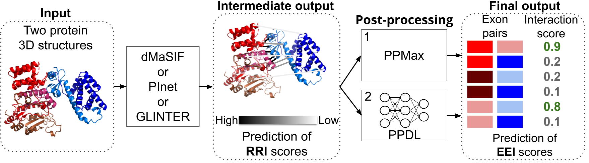

# The power and limits of protein 3D structure-based exon-exon interaction prediction


## Abstract
Alternative splicing (AS) effects on cellular functions can be captured by studying changes in the underlying protein-protein interactions (PPIs). Because AS results in the gain or loss of exons, existing methods for predicting AS-related PPI changes utilize known inter-protein exon-exon interactions (EEIs), which cover less than 0.5% of known human PPIs. Hence, there is a need to extend the existing limited EEI knowledge to advance the functional understanding of AS. Here, we explore whether existing 3-dimensional (3D) protein structure-based computational PPI interface prediction (PPIIP) methods, originally designed to predict inter-protein residue-residue interactions (RRIs), can be utilized to predict EEIs. We evaluate the PPIIP methods for the RRI- as well as EEI-prediction tasks using all known experimentally determined 3D structures of human protein heterodimers from the Protein Data Bank available at the time of data collection. From these heterodimers we determined ~230,000 RRIs and ~20,400 EEIs as ground truth. We provide the first evidence of the adaptability of existing PPIIP methods to predict EEIs, with a performance score of up to ~50% based on F-score with a false discovery rate of 5%. Insights, data, and computational pipelines from our study have the potential to guide future developments of computational methods for solving the task of predicting EEIs.  

## Hardware requirements
Models have been trained on either a NVIDIA A40 or a single Tesla T4 GPU.

## Software prerequisites
Before you begin, ensure that you have the following prerequisites installed on your system:
- [Anaconda](https://www.anaconda.com/products/distribution) or [Miniconda](https://docs.conda.io/en/latest/miniconda.html)
- `pip` package manager
- `python` >=3.11

## Installation Steps
Given CUDA version 12.6, the following installation guide was tested.

### 1. Create conda environment
```bash
conda create -n eeip python=3.11
```

### 2. Activate conda environment
```bash
conda activate eeip
```

### Optional: Install C-compiler in environment
```bash
conda install -c conda-forge gxx
conda install -c conda-forge cxx-compiler
```

### 3. Clone the repository
```bash
git clone https://github.com/lieboldj/EEIpred
cd eeip/
```

### 4. Install required packages from requirements.txt via pip
```bash
cat requirements.txt | xargs -L 1 pip install
```

## Usage
We provide an example with two input pdb files and the corresponding exon mapping files to predict the exon-exon interactions for these two proteins. 

### Prediction of EEIs
To predict the exon-exon interactions between the examples 1efx_C and 1efx_A, run

```bash
./get_eeip.sh
```
You find the predictions in the folder which will be displayed.
For details regarding dmasif environment, we refer to the original [dMaSIF github](https://github.com/FreyrS/dMaSIF).

### Reproducing our results
You can download all our pre-trained models and dataset list which gets automatically directed to the correct paths via: 
```bash
./download_supp_data.sh
```
We explain the steps for collecting the pdb files and creating the exon mapping files in our paper to reproduce the results. You can also create them yourself in an R environment by running the [R-code](https://github.com/lieboldj/EEIpred/blob/master/data_collection/scripts/generate_exon_data.sh) in our git repo. If you are interested in using our data, please contact [Khalique Newaz](khalique.newaz@uni-hamburg.de). 

Tun run the IDR analysis, we ask you to download the StrIDR database their [Website](https://isblab.ncbs.res.in/stridr/download/).

### Adding hydrogen atoms to PDB files
If you have PDB files and need to add hydrogen atoms, you can use the software "reduce." Reduce is a program for adding hydrogens to a protein structure given the 3D coordinates of the heavy atoms. 

To install Reduce and learn how to use it, you can refer to the [Reduce GitHub repository](https://github.com/rlabduke/reduce) for installation instructions and usage guidelines.

```bash
reduce -build -Quiet XXX.pdb > XXX.pdb
```

To run our prediction for your own pair of proteins, you need to follow these steps:

Please add the pdb files in _EEIpred/dmasif/surface_data/raw/01-benchmark_pdbs_, add the pdb names in _EEIpred/data_collection/cv_splits/EXAMPLE/test1.txt_ and the protein names in _EEIpred/data_collection/cv_splits/EXAMPLE/test_info1.txt_. Add the protein to exon mapping file to the folder _EEIpred/data_collection/uniprot_EnsemblExonPDB_map_. After these steps, you get the predictions for your protein pair runnning: ```./get_eeip.sh```.

## License
This work is licensed under a Creative Commons Attribution 4.0 International Public License.


## Reference
Liebold J, Del Moral Morales A, Manalastas-Cantos K, Tsoy O, Kurtz S, Baumbach J, Newaz K (2024). The power and limits of protein 3D structure-based exon-exon interaction prediction. [bioRxiv](https://www.biorxiv.org/content/10.1101/2024.03.01.582917v1)

